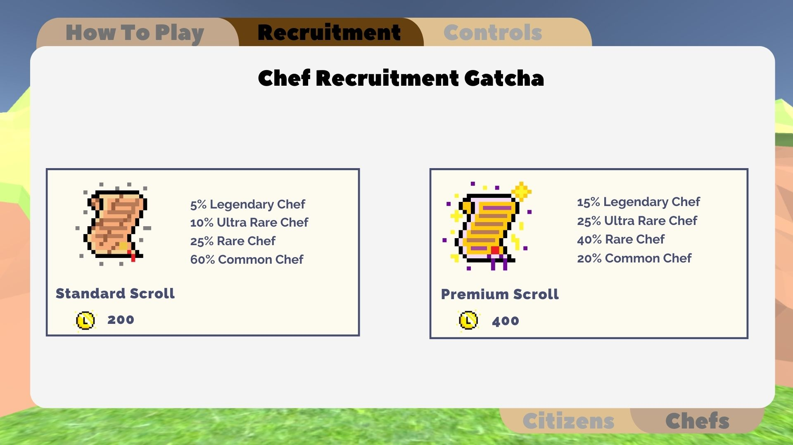
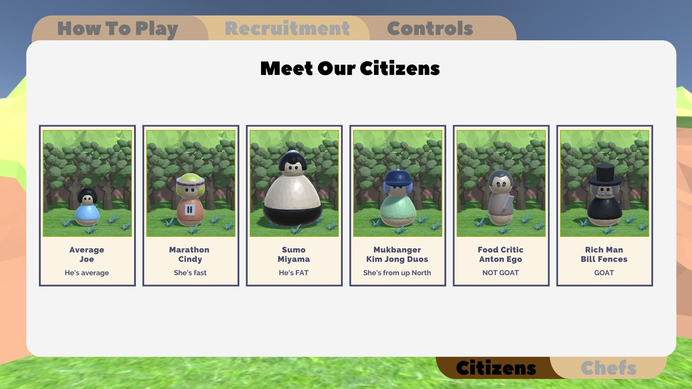

**The University of Melbourne**

# COMP30019 – Graphics and Interaction

## Teamwork plan/summary

<!-- [[StartTeamworkPlan]] PLEASE LEAVE THIS LINE UNTOUCHED -->

<!-- Fill this section by Milestone 1 (see specification for details) -->

| Name            | Responsibility                |
| :-------------- | :---------------------------- |
| Caroline Voo    | Procedural Generation Map     |
|                 | Evaluation                    |
| Livya Riany     | Heads Up Display (HUD)        |
|                 | Model Chefs, Citizen, Foods   |
|                 | Audio and Sound Effect        |
|                 | Implement Citizens            |
| Yuji Nojima     | Procedural Generation Citizen |
|                 | Implement Chefs and Gacha     |
|                 | Manage bullet effects (slow,dmg)|

<!-- [[EndTeamworkPlan]] PLEASE LEAVE THIS LINE UNTOUCHED -->

## Final report

### Table of contents

* [Game Summary](#game-summary)
* [Technologies](#technologies)
* [How To Play The Game](#how-to-play-the-game)
* [Gameplay Related Design](#gameplay-related-design)
* [Graphics Pipeline](#graphics-pipeline)
* [Procedural Generation](#procedural-generation)
* [Particle System](#particle-system)
* [Evaluation](#evaluation)
* [References](#references)

### Game Summary

With the high demand of Laksa in the modern world, people are all craving to have their hunger sated, some with different needs and hangry tolerance. With enemies coming in all shapes and sizes, eg Sumos, Food Critiques, 'That' Korean MukBang Influencer, or the average Joe. Tower defense but with the emergence of gacha, you must wish for your chefs, will you risk it all in the premium gacha or the standard gacha to summon your chefs on the field. Upon Choosing a map, you will have a choice to spend your starting coins on 2 standard pulls, or 1 premium to protect your kitchen from the waves of hungry citizens. You can place your chefs on the map and upgrade them to take them closer to their potentials. Save the kitchen for as long as you can as the waves won't stop until they are sated! Be careful for the Rich tourists, or even the rush hour... See you in the laksa kitchen!

### Technologies

Project is created with:

* Unity 2022.1.9f1
* Blender version 3.3.0
* Canva

### How To Play The Game

#### 1. Select map

Theres a selection between 3 different themed maps that you could pick from; Castle, Desert, and Shore.

<p align="center">
    
</p>

#### 2. Start the game and select a scroll (Standard Scroll or Premium Scroll)

<p align="center">
    
</p>
    At the start of the game you are given 500 Laksa Coins which could be used to purchase either 2 Standard Scroll or 1 Premium Scroll; a Standard Scroll costs 200 Laksa Coins and a Premium Scroll costs for 400 Laksa Coins. With a higher price, Premium Scroll would have higher odds on recruiting a more professional chef. Each chef is unique as they would feed citizens their speciality cuisine.

Here are the gacha chances you would be faced when purchasing a scroll:

<p align="center">
    
     
</p>

#### 3. Purchase scroll

Place the scroll beside the path that has different color than the base map. Usually 1 tile beside the paths of the citizen. See what chef you have recruited!
<p align="center">
    
</p>
<p align="center">
    
</p>

#### 4. Enjoy the chefs feeding the citizens

Let the chef feed the citizens their specialised foods. Once the citizens are full, they would exlode and give us coins.

<p align="center">
    
</p>

#### 5. Defend Kitchen

Use coins to purchase more scroll and test your luck to defend the kitchen!

You start off with 40 lives, if a number of enemies reach the end, they will take a number of your lives.

\* Protip: If you place the scroll on the correct tile and have enough money, you can spam and purchase multiple scrolls!

### Gameplay Related Design

#### Balancing
Many factors need to be taken into consideration to keep the game challenging and not too simple. Factors include coins dropped, damage outputted and damage tanked by the enemies.

#### Maps

#### Citizen, Chef, Food

The citizens, chefs, and foods are customly modeled and rendered through Blender version 3.3.0. Initially we wanted to create a 3D cartoon game which has an overhead camera. Therefore, we took heavy inspiration on the models based on the game Overcooked 2. It has the foods, people, and chefs that is very similar to our concept. Additionally, it has a overhead camera point of view so when designing we knew already  roughly how our model would look in Unity. The baseframe of the people are similar to Overcooked 2, round head and a cone with half sphere as a base body. These models only have solid colors without any texture. We wanted to keep it clean and simple.

<p align="center">
    
     
</p>

Design  Inspirations:

* Citizen
  * Average Joe: Overcooked 2 chefs without chef attributes
  * Marathon Cindy: Sinead Diver, an Australian long distance runner
  * Sumo Miyama: Wakatakakage Atsushi, a Japanese professional sumo wrestler
  * Mukbanger Kim Jong Duos: Teenagers with baseball hat
  * Food Critic Anton Ego: Anton Ego from movie Ratatouille
  * Rich Man Bill Fences: Aristocrat with a top hat
* Chef
  * Sushiherro Yuji: Sushi chefs with traditional headband
  * Laksa Mania Caroline: Normal chef from Overcooked 2
  * Indomie Ivy: Indonesian with traditional ricefield hat
  * Coco's Rosie: Basic person
  * Pizza Izza: Normal chef from Overcooked 2
  * Kami's Chungen: Sushi chefs with traditional headband
  * Dunkin Dougie: Dunkin Doughnut staff
  * Sunbucks Bucky: Starbucks staff
  * Trainway Bucky: Subway staff
  * Farmer Dan: American farmer
* Food
  * Sushi: 6 set of sushi with salmon, cucumber, and carrot
  * Laksa: Stir-fried pork food in Overcooked 2 as the soup and a simple bowl
  * Indomie: A pack  of indomie
  * Boba: Gongcha's boba drink
  * Pizza: Pepperoni pizza
  * Korean Chicken: 2 drumstick fried chicken
  * Doughnut: Doughnut with pink icing
  * Coffee: Starbucks coffee drink with sleve
  * Sandwich: Grilled cheese sandwhich
  * Egg: An egg
  * Meat: Raw porterhouse meat
  * Carrot: A carrot

### Graphics Pipeline

#### Toon Shader

As our concept is a 3D cartoonish game, we decided to create Toon Shader. This shader deliberately create 3D objects to appear toonish. Final color of each pixel is calculated using Blinn-Phong, with threshold value creating a cartoon effect.

For the light, we calculate if the pixel is lit or its a shadow by doing dot product on the light source and normal of the item. Additionally, we need to take into account other items, if light source is covered by them. By using "smoothstep", it would intensify the color of light and dark.

```C#
// Calculate item's light to be distinct
float3 normal = normalize(i.worldNormal);
float NdotL = dot(_WorldSpaceLightPos0, normal);
float shadow = SHADOW_ATTENUATION(i); 
float lightIntensity = smoothstep(0, 0.01, NdotL * shadow);
float4 light = lightIntensity * _LightColor0; 
```

For specular reflection of the pixel, we implemented Blinn-Phong reflection model. Calculating the half vector between the light vector and the view vector, using the formula $H = {L + V \over || L + V ||}$. Then dot product the result with the normal of the item to calculate intensity of specular reflection. After calculate the size of the specular by multipy the result with light intensity of the pixel and power it to the glossiness variable. Lastly utilize "smoothstep" again to intensify the difference between pixel colors.

```c#
// Calculate Blinn-Phong specular reflection  
float3 viewDir = normalize(i.viewDir);
float3 halfVector = normalize(_WorldSpaceLightPos0 + viewDir); 
float NdotH = dot(normal, halfVector); 
float specularIntensity = pow(NdotH * lightIntensity, _Glossiness * _Glossiness); 
float specularIntensitySmooth = smoothstep(0.005, 0.01, specularIntensity);
float4 specular = specularIntensitySmooth * _SpecularColor;
```

For rim lighting, it gives an illumination effect at the edges of the item. Firstly calculate surfaces that are facing away from the camera. Then multiply it with the normal of light intensity power a certain threshold (how far rim extends). Lastly, using "smoothstep" to give the cartoon effect.

```c#
// Illumination to the edges (rim lighting)
float4 rimDot = 1 - dot(viewDir, normal); 
float rimIntensity = rimDot * pow(NdotL, _RimThreshold);
float rimIntensitySmooth = smoothstep(_RimAmount - 0.01, _RimAmount + 0.01, rimIntensity);
float4 rim = rimIntensitySmooth * _RimColor;
```

Lastly, sum everything to produce the pixel color.

```c#
return _Color * col * (_AmbientColor + light + specular + rim);
```

 \* Code snippets from <https://github.com/COMP30019/project-2-laksa-novona/blob/main/Assets/Shader/toon.shader>

#### Water Shader

### Procedural Generation

#### Map

#### Enemy

### Particle System

We have implemented 2 particle system in Laksa Mania. Both particle system are implemented when the chefs throws food on the citizens. One is a tiny effect of crumbs falling off when the citizen consumes the food (when food collides with citizens). The other one which we would love to highlight is when the  citizen is full, it will explode into coin particles.These coin particles would represent that when citizens are full, player would gain coins from them.

<p align="center">
    
</p>

The implementation file can be located in <https://github.com/COMP30019/project-2-laksa-novona/blob/main/Assets/Prefabs/Particle%20System/particle_system_enemy.prefab>.

<p align="center">
    
</p>

Below are the particle systems that we varied:

| Name            | Option          | Values                               |
| :-------------- | :-------------- | :----------------------------------- |
| Particle System | Duration        | 1                                    |
|                 | Start Lifetime  | 4                                    |
|                 | Start Speed     | [0,5]                                |
|                 | Start Size      | [0.5,1.5]                            |
| Emission        | Burst           | 2 Count in 5 Cycles, 0.01 Interval   |
| Shape           | Shape           | Sphere                               |
|                 | Radius          | 0.08                                 |
| Renderer        | Render Mode     | Mesh                                 |
|                 | Meshes          | Coin Mesh                            |
|                 | Material        | Gold with Toon Shader                |

We utilized randomisation using the feature "Random Between Two Constants" on the start speed and most importantly the start size. The start size is decided in ratio with the citizens so it won't be too big covering other actions but not too small making it unseen. Aside from that we also used burst emissions so theres more randomization by implementing 5 cycles with 0.01 interval and 2 particle each.

### Evaluation

#### Query and Observational Methods Used
We used Cooperative Evaluation for the Observation and Interviews for the Query technique. We split the players into two different types, ones that has played Tower Defence Games before and ones that have not. From observation, we found that some players thought the colour for the Path and Attack Tiles of Map2 is too similar to the colour of the map ground. Players also thought the first 10 waves of the game was too easy and requires not much effort. They think the "enemies" of the games were too weak and there were too many "average joes", which is the weakest enemy of the game. There was one player who thought there were too many "attack tiles" and should decrease the amount to make the game more challenging or decrease the amount of coins earned when killing the "enemies". All of the players felt that the game needed to be more challenging. Most players found that the aesthetic was good and liked how the path changes everytime. They also voiced out how detailed the characters are. For the query part, we generated some questions for the interview. The first questions was "Do they like the overall aesthetic of the game"

#### Changes Made

### References

#### Audio

* Main Menu Theme Song: <https://assetstore.unity.com/packages/audio/music/casual-game-bgm-5-135943>
* Desert Theme Song: <https://assetstore.unity.com/packages/audio/music/ancient-egyptian-desert-music-free-pack-131425>
* Shore Theme Song: <https://assetstore.unity.com/packages/audio/music/pirate-music-album-050418-118488>
* Castle Theme Song: <https://assetstore.unity.com/packages/audio/music/casual-kingdom-world-sounds-free-136406>
* Shooting Sound Effects: <https://assetstore.unity.com/packages/audio/sound-fx/shooting-sound-177096>
* Other Sound Effects: <https://assetstore.unity.com/packages/audio/sound-fx/score-and-time-59255>

#### Castle Map Assets

* Trees Prefab : <https://assetstore.unity.com/packages/3d/vegetation/trees/free-trees-103208>
* Castle Prefab : <https://assetstore.unity.com/packages/3d/environments/forest-low-poly-toon-battle-arena-tower-defense-pack-100080>
* Village Prefab :<https://assetstore.unity.com/packages/3d/polygon-city-pack-environment-and-interior-free-101685>
* Grass Material: <https://assetstore.unity.com/packages/2d/textures-materials/nature/nature-materials-vol-1-21113>
* Flower and Stones Prefab : <https://assetstore.unity.com/packages/3d/environments/landscapes/free-low-poly-nature-forest-205742>

#### Desert Map Assets

* Pyramids Prefab: <https://assetstore.unity.com/packages/3d/environments/landscapes/desert-kits-64-sample-86482>
* Dessert Houses Prefab: <https://assetstore.unity.com/packages/3d/environments/desert-village-houses-lowpoly-200247>
* Rocks Prefab: <https://assetstore.unity.com/packages/3d/environments/landscapes/polydesert-107196>
* Sand Material: <https://assetstore.unity.com/packages/2d/textures-materials/free-stylized-pbr-textures-pack-111778>
* Water Textures : <https://assetstore.unity.com/?q=water%20texture&orderBy=1>

#### Shore Map Assets

* Pirate Ship Prefab: <https://assetstore.unity.com/packages/3d/vehicles/sea/stylized-pirate-ship-200192>
* Boats Prefab: <https://assetstore.unity.com/packages/3d/vehicles/sea/boats-polypack-189866>
* Beach Houses Prefab: <https://assetstore.unity.com/packages/3d/environments/historic/3d-pirates-lowpoly-pack-233903>
* Wood Plank Prefab: <https://assetstore.unity.com/packages/2d/textures-materials/wood/plank-textures-pbr-72318>
* Water Material: <https://assetstore.unity.com/packages/2d/textures-materials/floors/five-seamless-tileable-ground-textures-57060>
* Sand Material: <https://assetstore.unity.com/packages/2d/textures-materials/free-stylized-pbr-textures-pack-111778>
* Palm Tree Prefab: <https://assetstore.unity.com/packages/3d/vegetation/trees/free-trees-103208>

#### Toon Shader Resources

* Blinn-Phong Reflection: <https://en.wikipedia.org/wiki/Blinn%E2%80%93Phong_reflection_model>
* Cel Shading: <https://www.youtube.com/watch?v=mnxs6CR6Zrk>
* Basic Shader Information: <https://docs.unity3d.com/Manual/SL-VertexFragmentShaderExamples.html>
* Toon Shading Steps:  <https://roystan.net/articles/toon-shader/>
* Toon Shading Information: <https://en.wikibooks.org/wiki/Cg_Programming/Unity/Toon_Shading>
* Toon Shader in HLSL Language: <https://gist.github.com/JSandusky/4f9a4f00110691eb45104f69abd32f75>
* Inspiration: <https://docs.unity3d.com/Packages/com.unity.toonshader@0.6/manual/index.html>
* Analysis on Toon Shader: <https://www.youtube.com/watch?v=HD85S4TYVjg>

#### Others

* Buttons Images: <https://assetstore.unity.com/packages/2d/gui/buttons-set-211824>
* Canva "How To Play" Template: <https://www.canva.com/design/DAFP7Gh3YFU/4xQJ5-E4pOfaxq9WTIvf8A/view?utm_content=DAFP7Gh3YFU&utm_campaign=designshare&utm_medium=link2&utm_source=sharebutton>
